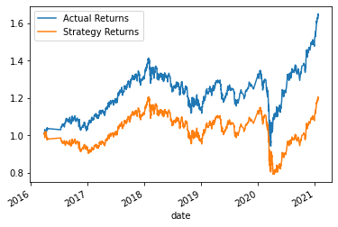

# AlgoMLTrading
This project combines Algorithmic Trading with Machine Learning models to maximize returns. It was done under Northwestern's Fintech Bootcamp.

When running the SVC model with a 3 month interval, we got the following results:
           precision    recall  f1-score   support

        -1.0       0.41      0.08      0.13      1804
         1.0       0.56      0.91      0.69      2288

    accuracy                           0.54      4092
   macro avg       0.48      0.49      0.41      4092
weighted avg       0.49      0.54      0.44      4092

 
Here is the plot:
 

 
Here is at 6 months:
              precision    recall  f1-score   support

        -1.0       0.44      0.20      0.28      1732
         1.0       0.56      0.80      0.66      2211

    accuracy                           0.54      3943
   macro avg       0.50      0.50      0.47      3943
weighted avg       0.51      0.54      0.49      3943

Here is at 1 year:
              precision    recall  f1-score   support

        -1.0       0.00      0.00      0.00      1497
         1.0       0.56      1.00      0.72      1931

    accuracy                           0.56      3428
   macro avg       0.28      0.50      0.36      3428
weighted avg       0.32      0.56      0.41      3428

Six months is best.

Then I changed the short window to 30 instead of 4. This is the result:
             precision    recall  f1-score   support

        -1.0       0.45      0.26      0.33      1651
         1.0       0.57      0.75      0.65      2120

    accuracy                           0.54      3771
   macro avg       0.51      0.51      0.49      3771
weighted avg       0.52      0.54      0.51      3771

Then I changed the long window to 200 instead of 100, keeping short at 30.
              precision    recall  f1-score   support

        -1.0       0.36      0.06      0.10      1496
         1.0       0.56      0.92      0.69      1929

    accuracy                           0.54      3425
   macro avg       0.46      0.49      0.40      3425
weighted avg       0.47      0.54      0.43      3425

Better to keep long at 100.

 
Classification Tree:
              precision    recall  f1-score   support

        -1.0       0.44      0.96      0.60      1484
         1.0       0.56      0.04      0.07      1921

    accuracy                           0.44      3405
   macro avg       0.50      0.50      0.33      3405
weighted avg       0.51      0.44      0.30      3405

Results not that great.
Here is the plot: 

